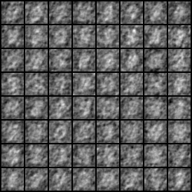
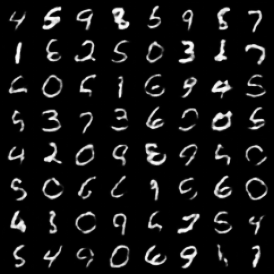
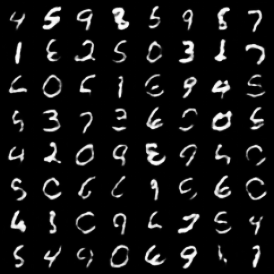

# IGN-pytorch

> Shocher, Assaf, Amil Dravid, Yossi Gandelsman, Inbar Mosseri, Michael Rubinstein, and Alexei A. Efros. "Idempotent Generative Network." *arXiv preprint arXiv:2311.01462* (2023).

**Unofficial** implementation of Idempotent Generative Network.


## Installation

Clone this repo:

```shell
git clone https://github.com/xyfJASON/IGN-pytorch.git
cd IGN-pytorch
```

Create and activate a conda environment:

```shell
conda create -n ign python=3.11
conda activate ign
```

Install dependencies:

```shell
pip install -r requirements.txt
```


## Training

First, compute FFT statistics if you want to use FFT as initial noise instead of standard Gaussian.

```shell
python compute_freq_stats.py -c CONFIG [-n NUM] --save_file SAVE_FILE
```

- By default, the script will use the first 1000 images from dataset to compute the statistics. Use `-n NUM` to change the number of images.
- After computing, set `noise_stats` in the configuration file to the path of your computed statistics file.
- Statistics on some datasets are already computed by me and uploaded in `./freq_stats`.

Now, we can start training!

```shell
accelerate-launch train.py -c CONFIG [-e EXP_DIR] [--xxx.yyy zzz ...]
```

- This repo uses the [🤗 Accelerate](https://huggingface.co/docs/accelerate/index) library for multi-GPUs/fp16 supports. Please read the [documentation](https://huggingface.co/docs/accelerate/basic_tutorials/launch#using-accelerate-launch) on how to launch the scripts on different platforms.
- Results (logs, checkpoints, tensorboard, etc.) of each run will be saved to `EXP_DIR`. If `EXP_DIR` is not specified, they will be saved to `runs/exp-{current time}/`.
- To modify some configuration items without creating a new configuration file, you can pass `--key value` pairs to the script.

For example, to train the model on MNIST with default setting:

```shell
accelerate-launch train.py -c ./configs/ign_mnist.yaml
```

Or if you want to try out Gaussian noise:

```shell
accelerate-launch train.py -c ./configs/ign_mnist.yaml --train.noise_type gaussian
```


## Sampling

```shell
accelerate-launch sample.py -c CONFIG \
                            --weights WEIGHTS \
                            --n_samples N_SAMPLES \
                            --save_dir SAVE_DIR \
                            [--repeat REPEAT]
                            [--batch_size BATCH_SIZE]
```

- Use `--repeat REPEAT` to specify the number of times to applying the model repeatedly. For example, `--repeat 2` means $f(f(z))$.
- Adjust the batch size on each device by `--batch_size BATCH_SIZE`.


## Results


### MNIST

|                 $z$                 |               $f(z)$                |              $f(f(z))$              |            $f(f(f(z)))$             |
| :---------------------------------: | :---------------------------------: | :---------------------------------: | :---------------------------------: |
|  |  |  |  |

